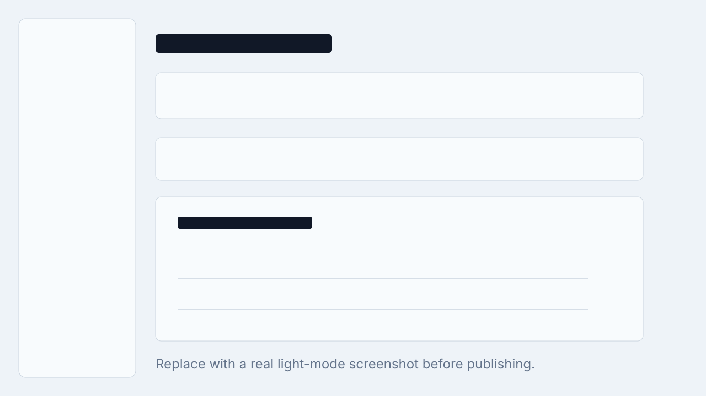
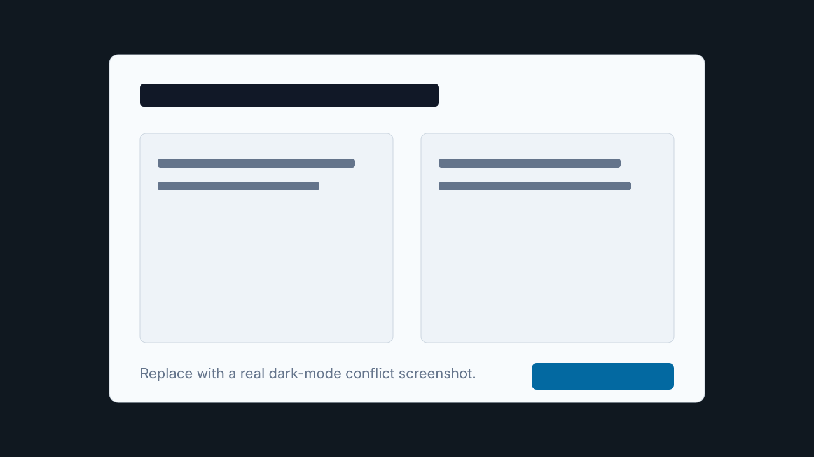
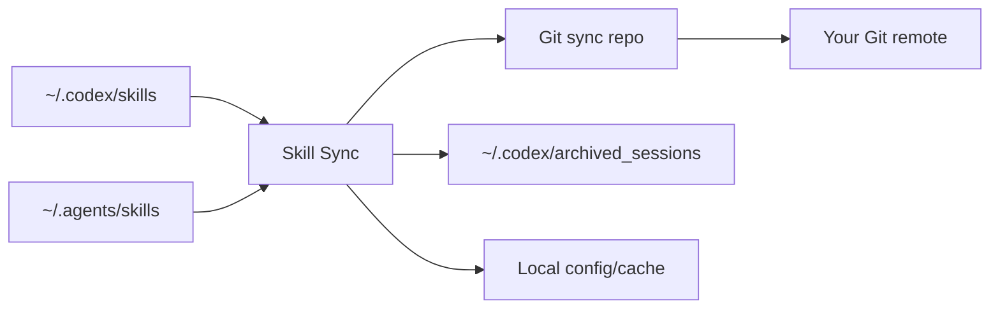

# Skill Sync

[中文说明](./README.zh-CN.md)

[](./.github/workflows/ci.yml)
[](https://www.npmjs.com/package/@nameczz/skill-sync)
[](./LICENSE)
[](https://nodejs.org/)

Skill Sync is a local-first tool for syncing Codex skills across computers through your own Git repository. It also shows when each skill was last used, making it easier to prune skills you no longer need, and includes a Codex Archive manager for archived sessions.

Skills are local folders. That is great for creating and editing them quickly, but awkward once you use Codex on multiple machines or maintain a growing skill library. Skill Sync gives those folders a small local control plane: choose what to track, sync through Git, monitor usage, resolve conflicts, and manage archived Codex sessions. It currently supports Codex `~/.codex/skills` and Agents `~/.agents/skills`, with room for more runtimes later.

## Screenshots

These are placeholders. Replace them with real screenshots before sharing a launch post or article.

| Skills dashboard                                                            | Conflict / compare flow                                                       |
| --------------------------------------------------------------------------- | ----------------------------------------------------------------------------- |
|  |  |

Suggested real captures:

- `docs/screenshots/skills-dashboard.png`
- `docs/screenshots/codex-archive.png`
- `docs/screenshots/compare-conflict.png`
- `docs/screenshots/dark-mode.png`

## Features

- [x] Sync selected Codex and Agents skills across computers with your own Git repository.
- [x] Web UI for choosing tracked skills, reviewing local/repo state, resolving conflicts, and applying remote updates.
- [x] Auto-sync watcher that commits and pushes edits to tracked local skills.
- [x] Last-used monitoring from local Codex session traces so stale skills are easier to find and delete.
- [x] Codex Archive session management, including preview, Trash, restore, and unarchive.
- [x] Local-first storage: no hosted service, no central backend, and machine-specific config/cache stay out of Git.

## Future

- [ ] Claude-to-Claude skill sync.
- [ ] Claude and Codex skill sync/migration.
- [ ] Skill quality checks and optimization suggestions, such as description clarity, length, discoverability, and structure.

## Usage

Prerequisites:

- Node.js `>=20`
- Git
- macOS for the native directory picker
- A local folder or Git clone to use as the sync repository

### Web UI

Run without installing:

```bash
npx @nameczz/skill-sync serve
```

Or install the CLI globally:

```bash
npm install -g @nameczz/skill-sync
skill-sync serve
```

If `skill-sync` is not found after a global install, your npm global binary directory is not on `PATH`. Check the prefix:

```bash
npm config get prefix
```

Then add `<prefix>/bin` to your shell `PATH`. For example, if the prefix is `~/.npm-global`:

```bash
echo 'export PATH="$HOME/.npm-global/bin:$PATH"' >> ~/.zshrc
source ~/.zshrc
```

Already-open terminals need `source ~/.zshrc` or a restart before they can see the new command.

Open [http://127.0.0.1:3017](http://127.0.0.1:3017).

On first launch:

1. Choose the Git sync repository directory.
2. Initialize the manager.
3. Add local-only skills to sync.
4. Let auto-sync watch managed skills, or use manual actions when you want explicit control.

### CLI

Use the CLI for headless or agent-driven workflows. `skill-sync serve` starts the local API server, Web UI, auto-sync watcher, and usage scanner.

Initialize once with an explicit sync repository path:

```bash
skill-sync init --sync-repo /path/to/skills-sync
```

Then keep the watcher running:

```bash
skill-sync serve
```

Common commands:

```bash
skill-sync status
skill-sync status --json
skill-sync pull
skill-sync sync <skill-id>
skill-sync update-local <skill-id>
skill-sync stop-syncing <skill-id>
skill-sync serve --port 4100
```

Agents can edit tracked skills under `~/.codex/skills` or `~/.agents/skills`. Skill Sync detects local changes, copies them into the sync repo, commits, and pushes.

If a conflict appears, do not overwrite silently. Resolve it through the Web UI or an explicit CLI/API action.

### Run from Source

```bash
yarn install
npm run dev -- serve
```

## Sync Model

The sync repository stores shared state:

```text
skills/                 # tracked skill folders
metadata/skills.json    # tracked skill metadata
metadata/usage-events.jsonl
.gitignore
```

Your machine keeps local-only state outside Git:

```text
~/.skill-sync/config.json
~/.skill-sync/cache/
```

At a high level:



## Typical Workflows

**Add a local skill to sync**

1. Open the Skills page.
2. Find a `Local only` skill.
3. Click `Add to sync`.
4. The app copies it into the sync repo, updates metadata, commits, and pushes.

**Use another machine**

1. Clone or choose the same sync repository.
2. Initialize Skill Sync with that repo path.
3. Click `Pull`.
4. Apply repo changes to install missing local copies.

**Resolve a conflict**

1. Open the compare dialog for the skill.
2. Review the repo, Codex, and Agents versions.
3. Accept the version you want to keep.
4. The app updates metadata, commits, and pushes the resolution.

## Codex Archive

Codex App can archive sessions into `~/.codex/archived_sessions`. Skill Sync exposes those sessions in the web UI so you can:

- Search archived sessions.
- Preview metadata without loading the full file by default.
- Move an archived session to Trash.
- Restore from Trash.
- Unarchive a session back into Codex sessions.

## Documentation

Local docs site:

```bash
npm run docs:dev
npm run docs:build
```

Useful docs:

- [Getting Started](./docs/guide/getting-started.md)
- [Sync Model](./docs/guide/sync-model.md)
- [API Reference](./docs/reference/api.md)

## Development

Run checks:

```bash
npm run typecheck
npm test
npm run build
```

Run with isolated test paths:

```bash
SKILL_SYNC_REPO=/tmp/skill-sync-repo \
SKILL_SYNC_CODEX_SKILLS_DIR=/tmp/skill-sync-codex \
SKILL_SYNC_AGENTS_SKILLS_DIR=/tmp/skill-sync-agents \
SKILL_SYNC_CONFIG_DIR=/tmp/skill-sync-config \
SKILL_SYNC_CACHE_DIR=/tmp/skill-sync-cache \
npm run dev -- serve
```

Legacy `CSM_*` environment variables and `~/.codex-skill-manager` config are still read for compatibility.

## Publishing

The npm package is published by `.github/workflows/publish-npm.yml` using npm Trusted Publishing, so no long-lived npm publish token is needed after the package exists on npm.

1. Rename or create the GitHub repository that matches `package.json`'s `repository.url`.
2. Publish `@nameczz/skill-sync@0.1.0` once manually if the package does not exist yet:
   ```bash
   npm login
   npm publish --access=public
   ```
3. On npmjs.com, open the `@nameczz/skill-sync` package settings and add a Trusted Publisher:
   - Provider: GitHub Actions
   - Organization/user: `nameczz`
   - Repository: `skill-sync`
   - Workflow filename: `publish-npm.yml`
   - Allowed action: `npm publish`
4. Publish future versions with a GitHub Release, or run the `Publish npm` workflow manually with `dry-run` set to `false`.

You can also configure the trusted publisher from the CLI after the first publish:

```bash
npm trust github @nameczz/skill-sync --repo nameczz/skill-sync --file publish-npm.yml --allow-publish
```

The workflow installs dependencies, runs typecheck, tests, build, `npm pack --dry-run`, then publishes with OIDC-backed npm provenance.

## Project Structure

```text
skill-sync/
├── src/                # CLI, sync, git, archive, usage scanner, server
├── web/                # local management UI
├── tests/              # Vitest coverage
├── docs/               # docs and screenshot placeholders
├── .github/            # CI workflows and GitHub metadata
└── README.md
```

## Contributing

Issues and pull requests are welcome. No special template is required; a clear description, reproduction steps for bugs, and screenshots or logs when relevant are enough.

Before opening a PR, please run:

```bash
npm run typecheck
npm test
npm run build
```

See [CONTRIBUTING.md](./CONTRIBUTING.md), [CODE_OF_CONDUCT.md](./CODE_OF_CONDUCT.md), and [SECURITY.md](./SECURITY.md) for project expectations.

## License

MIT. See [LICENSE](./LICENSE).
