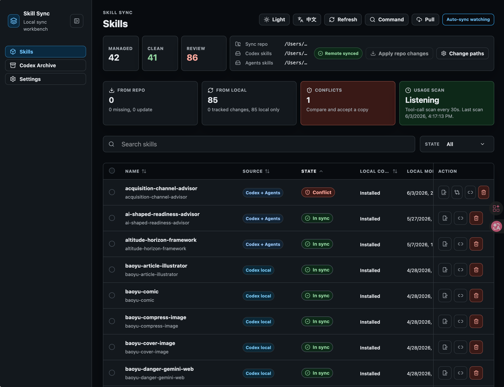
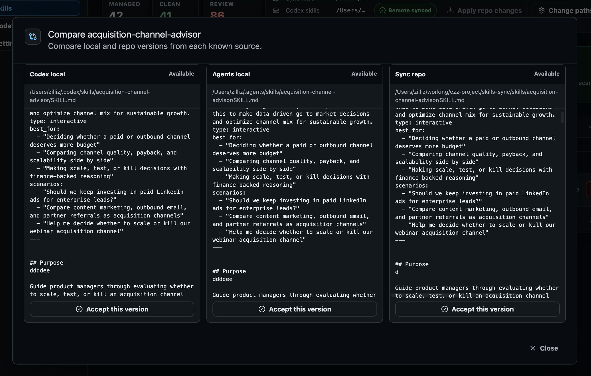

# Skill Sync

[English](./README.md)

Skill Sync 是一个本地优先的 Codex skill 管理和同步工具。它把你安装或自己创建的 skills 放进你自己的 Git 同步仓库里，让不同电脑上的 Codex 可以共享同一套 skills，并通过 Web UI 或 CLI 管理它们。

Codex / Agent 的 skills 本质上只是本地文件——不会在多台机器之间自动同步。
在公司电脑上改了某个 skill，回家后不会出现在笔记本上；两边同时改过，手动合并很容易覆盖错版本。
时间久了，skills 还会默默积累：你不记得哪些还在用，想清理也没有依据。

Skill Sync 的做法是以你自己的 Git 仓库为同步源。
你选择要跟踪哪些 skills，工具负责跨机器同步，并在版本冲突时让你逐一对比、决定保留哪个。

它同时会在本地运行一个轻量服务，扫描 Codex session traces，记录每个 skill 最近被 agent 使用的时间——
这样清理时就有了真实的使用数据作依据。

整个工具保持本地优先：没有托管后端，没有中心化服务，skills 只通过你自己的 Git remote 同步。

## 功能

- [x] 通过你自己的 Git 仓库，在不同电脑之间同步 Codex / Agents skills。
- [x] Web UI：选择要跟踪的 skills，查看本地/仓库状态，处理冲突，应用远程更新。
- [x] 自动同步：监听已跟踪 skill 的本地修改，自动 commit/push 到同步仓库。
- [x] 使用时间监控：从本地 Codex session traces 里提取 last used，帮助你发现长期没用的 skill。
- [x] Codex Archive 管理：查看 archived sessions，支持预览、移入 Trash、恢复、取消归档。
- [x] 本地优先：不提供 SaaS，不需要中心化后端，本机配置和 cache 不进入 Git。
- [ ] Claude 到 Claude 的 skill 同步。
- [ ] Claude 和 Codex 之间的 skill 同步 / 迁移。
- [ ] Skill 优化检查和建议，比如 description 是否容易命中、内容是否太长、结构是否清晰。

## 使用

前置要求：

- Node.js `>=20`
- Git repo

### Web UI

不安装，直接运行：

```bash
npx @nameczz/skill-sync serve
```

或者全局安装 CLI：

```bash
npm install -g @nameczz/skill-sync
skill-sync serve
```

如果全局安装后提示 `skill-sync: command not found`，说明 npm global binary 目录不在 `PATH` 里。先看 prefix：

```bash
npm config get prefix
```

然后把 `<prefix>/bin` 加到 shell `PATH`。比如 prefix 是 `~/.npm-global`：

```bash
echo 'export PATH="$HOME/.npm-global/bin:$PATH"' >> ~/.zshrc
source ~/.zshrc
```

已经打开的 terminal 需要执行 `source ~/.zshrc`，或者重新开一个 terminal，才能识别新命令。

打开：

```text
http://127.0.0.1:3017
```

第一次启动：

1. 选择 Git sync repository 目录。
2. 初始化 Skill Sync。
3. 把本机 `Local only` skills 添加到同步。
4. 后续由 auto-sync 自动监听已跟踪 skill 的变化，也可以手动执行操作。

Web UI 是主要管理入口，用来选择要跟踪的 skills、应用仓库更新、查看本地状态。



当本地和仓库版本不一致时，可以打开比较弹窗，选择保留哪个版本。



### CLI

CLI 适合 headless 或 agent 自动化流程。`skill-sync serve` 会启动本地 API server、Web UI、auto-sync watcher 和 usage scanner。

先初始化一次，明确指定 sync repo：

```bash
skill-sync init --sync-repo /path/to/skills-sync
```

然后保持监听进程运行：

```bash
skill-sync serve
```

常用命令：

```bash
skill-sync status
skill-sync status --json
skill-sync pull
skill-sync sync <skill-id>
skill-sync update-local <skill-id>
skill-sync stop-syncing <skill-id>
skill-sync serve --port 4100
```

agent 可以直接修改 `~/.codex/skills` 或 `~/.agents/skills` 下已跟踪的 skills。Skill Sync 会检测本地变化，复制到 sync repo，commit，并 push。

如果出现冲突，不要静默覆盖。应该通过 Web UI 或明确的 CLI/API 操作解决。

## 同步模型

sync repo 保存共享状态：

```text
skills/                 # tracked skill folders
metadata/skills.json    # tracked skill metadata
metadata/usage-events.jsonl
.gitignore
```

本机状态保存在 Git 之外：

```text
~/.skill-sync/config.json
~/.skill-sync/cache/
```

停止同步只会从 sync repo 移除该 skill 的跟踪状态，不会删除本机 skill copy。刷新后，如果本机 copy 仍在，它会显示为 `Local only`。

## 另一台电脑怎么同步

1. clone 同一个 sync repo。
2. 安装并启动 Skill Sync：

```bash
npm install -g @nameczz/skill-sync
skill-sync serve
```

3. 第一次初始化时选择同一个 sync repo。
4. 点击 `Pull` / `Apply repo changes`，把 repo 里的 skills 安装到本机。

## 开发

```bash
yarn install
npm run typecheck
npm test
npm run build
```

本地运行：

```bash
npm run dev -- serve
```

## License

MIT. See [LICENSE](./LICENSE).
